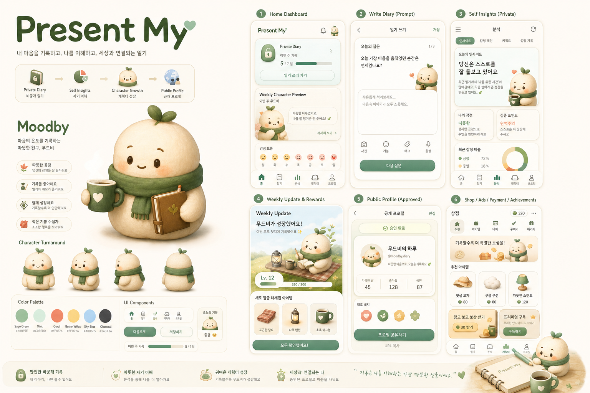

# Present My Visual Reference

## Reference Asset

Primary visual target:

Local file:

`assets/reference/present-my-ui-concept.png`

This image is the visual north star for the presentation webapp. It should be referenced before making UI, character, layout, color, and spacing decisions.

## Product Mood

The app should feel like an emotional character diary app:

- private and calm while writing diaries
- warm and trustworthy while showing self-understanding insights
- cute and memorable while showing the character
- polished and shareable while showing the public profile
- presentation-ready, not like a rough wireframe

Avoid making the product look like a generic dashboard, a finance/SaaS product, or a childish game. The tone is soft, polished, cozy, and modern.

## Character Direction

The mascot direction is `Moodby`.

Moodby should feel:

- soft and rounded
- warm cream or ivory base
- gentle face with simple expressive features
- cozy accessories such as a green scarf, mug, notebook, or room objects
- collectible enough for weekly growth
- simple enough to reproduce in CSS or as an image asset

The character is not just decoration. It is the visible result of private diary patterns. UI screens should make that connection clear.

## UI Direction

Use the reference image for these choices:

- warm ivory background
- sage green as primary color
- coral, butter yellow, mint, and light sky blue as accents
- charcoal text
- soft paper-like surfaces
- clean cards with subtle shadows
- rounded but not blob-like corners
- generous spacing with clear hierarchy
- mobile-app-like screen panels arranged in a webapp shell

Cards should look tactile and soft, but still organized. Avoid flat gray wireframes.

## Screen Requirements

### Home

Show:

- today's diary status
- weekly progress toward character update
- character preview
- private-first reassurance
- this week's insight keywords

### Diary

Show:

- mood selector
- prompt-based fields
- free diary field
- private save action
- copy that explains the diary original remains private

### Insights

Show:

- private analysis label
- repeated emotion
- taste keywords
- personality pattern
- weekly theme
- clear separation between private analysis and public output

### Character

Show:

- large Moodby character
- weekly update status
- unlocked items
- badges
- room/customization preview
- next update timing

### Public Profile

Show:

- public character card
- approved profile items
- toggles or checks for user approval
- explicit locked/private diary original row
- share link and name card actions

### Expansion UI

Show as presentation UI only:

- item shop
- ad reward
- payment guide
- achievements
- monetization roadmap

Do not implement real payment, ad, or purchase logic in the presentation MVP.

## Implementation Notes

- Use real image assets or high-quality CSS illustrations for the character; do not ship rough placeholder boxes.
- If a CSS character cannot match the reference quality, use `assets/reference/present-my-ui-concept.png` as a style reference and generate a dedicated character asset before final polish.
- Each screen should communicate its function visually without relying on long explanatory text.
- Keep the product optimized for presentation: stable sample data, clear flow, no backend dependency.

